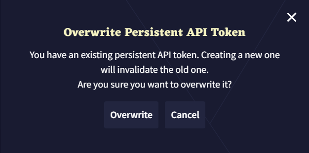

# NovelAI绘图

注意：NovelAI需要科学上网才能访问。

注意：NovelAI的提示词仅支持英文。

### 如何使用

首先你需要获取Presistant API Token

在设置的Account中，点击Get Presistant API Token。

即便第一次使用时也会提示已有Token是否覆盖，不要怕。

复制token到插件的Persistent API Token配置项中。
然后选择一个模型。

这样就完成了！

如果你还想微调生成参数，你可以修改 额外参数 配置项里的内容。

如果写错了参数导致无法生成，只需要清空该配置项，然后重启兔兔，插件会自动填入一个正确的默认值。

## 相关链接

[项目地址:Github](https://github.com/hsyhhssyy/amiyabot-hsyhhssyy-stable-diffusion/)

[遇到问题可以在这里反馈(Github)](https://github.com/hsyhhssyy/amiyabot-hsyhhssyy-stable-diffusion/issues/new/)

|  版本   | 变更  |
|  ----  | ----  |
| 0.1.0  | 最初的版本 |